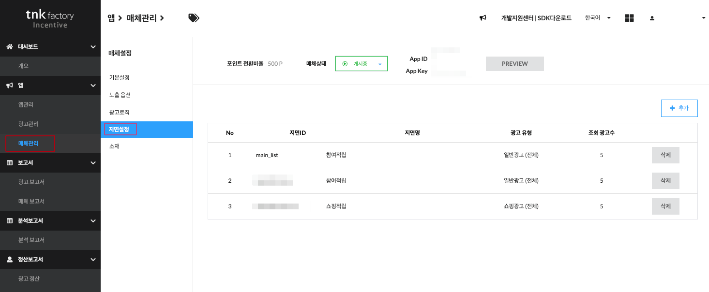
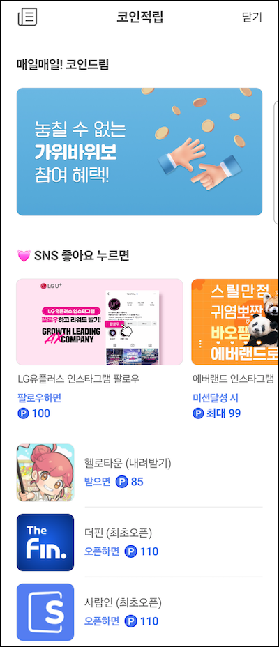

# Tnkfactory SDK Rwd

## 목차

1. [플레이스먼트뷰](#플레이스먼트뷰)

    * [플레이스먼트뷰 생성하기](#플레이스먼트뷰-생성하기)
    * [플레이스먼트 광고 표시](#플레이스먼트-광고-표시)
    * [customData 활용하기](#customData-활용하기)
    * [AdPlacementView의 UI 커스터마이징](#AdPlacementView의-UI-커스터마이징)
    * [AdPlacementActivity](#AdPlacementActivity)

2. [광고정보 조회 기능](#광고정보-조회-기능)
   * [광고 목록 조회](#광고-목록-조회)
   * [PlacementView 설정값 조회](#PlacementView-설정값-조회)
   * [광고 클릭 이벤트 처리](#광고-클릭-이벤트-처리)

# 플레이스먼트뷰

유저들의 오퍼월 진입을 보다 자연스럽게 유도하기 위하여 매체 내에 전면이나 바텀시트 또는 피드 형태로 오퍼월 광고를 제공할 수 있습니다. 


플레이스먼트뷰는 원하는 유형의 광고, 쇼핑, 이벤트 등을 노출할 수 있으며 노출되는 광고의 갯수나 UI 등도 모두 원하는 형태로 커스터마이징이 가능합니다. 오퍼월에서 제공하는 큐레이션 기능을 별도의 뷰 형태로 제공한다고 보시면 됩니다.

## AdPlacementView

### 플레이스먼트뷰 생성하기

플레이스먼트뷰를 표시하기 위해서는 우선 사용할 플레이스먼트에 대한 설정이 필요합니다.
 
[관리자 페이지] -> [매체관리] -> [앱 선택] -> [지면설정] 메뉴에서 설정 하실 수 있습니다.


플레이스먼트뷰에 광고를 로딩하기 위해서 아래와 같이 진행합니다. 아래의 예시는 placementContainerView 내에 플레이스먼트뷰를 표시하는 예시이며 "open_ad" 라는 플레이스먼트가 설정되어 있다고 가정합니다.

```kotlin

lateinit var adPlacementView : AdPlacementView

fun setupPlacementView() {
    // placementView를 생성합니다.
    adPlacementView = tnkOfferwall.getAdPlacementView(this)
    // placementView를 광고 영역에 추가합니다.
    placementContainerView.addView(adPlacementView)

    // placementView의 이벤트 리스너를 설정합니다.
    adPlacementView.placementEventListener = object : PlacementEventListener {
        override fun didAdDataLoaded(placementId: String, customData: String?) {
            // 광고가 로드 되면 광고를 보여줍니다.
            adPlacementView.showAdList()
        }

        override fun didFailedToLoad(placementId: String) {
            // 광고 로드 실패시 처리
            Toast.makeText(this@MainActivity, "광고 로딩 실패", Toast.LENGTH_SHORT).show()
        }

        override fun didAdItemClicked(appId: String, appName: String) {
            // 광고 클릭시 처리
            Log.d("didAdItemClicked", "appId : $appId, appName : $appName")
        }

        override fun didMoreLinkClicked() {
            // 더보기 링크 클릭시 여기서 광고 상세 화면으로 가는 처리를 추가합니다.
            tnkOfferwall.startOfferwallActivity(this@MainActivity)
        }
    }
}

// 광고가 노출될 레이아웃을 설정 후 목록을 로드합니다.
fun loadPlacementView() {
    TnkAdConfig.setPlacementLayout("open_ad", TnkAdPlacementFeedItem::class, PlacementFeedViewLayout::class)
    adPlacementView.loadAdList("open_ad")
}
```

```java

AdPlacementView adPlacementView;

void setupPlacementView() {
    adPlacementView = offerwall.getAdPlacementView(this);
    placementContainerView.removeAllViews();
    placementContainerView.addView(adPlacementView);
    loadPlacementView();


    adPlacementView.setPlacementEventListener(new PlacementEventListener() {

        @Override
        public void didAdDataLoaded(@NonNull String placementId, @Nullable String customData) {
            adPlacementView.showAdList();
        }

        @Override
        public void didFailedToLoad(@NonNull String placementId) {
            Toast.makeText(MainActivityJava.this, "광고 로딩 실패", Toast.LENGTH_SHORT).show();
        }

        @Override
        public void didAdItemClicked(@NonNull String appId, @NonNull String appName) {
            Log.d("didAdItemClicked", "appId : $appId, appName : $appName");
        }

        @Override
        public void didMoreLinkClicked() {
            offerwall.startOfferwallActivity(MainActivityJava.this);
        }
    });
}

void loadPlacementView() {
    adPlacementView.loadAdList("open_ad");
}
```

### 플레이스먼트 광고 표시

AdPlacementView 의 loadData() 를 호출하면 전달된 placement_id 에 설정된 값에 따라서 광고를 로딩합니다. 광고 로딩이 완료되면 PlacementEventListener 의 didAdDataLoaded() 가 호출됩니다.

아래는 PlacementEventListener 의 protocol 규약입니다.

```kotlin
/// AdPlacementView 내의 특정 이벤트들을 받아서처리 하기 위하여 사용됩니다.
/// AdPlacementView 객체의 placementListener 에 설정합니다.
public interface PlacementEventListener {

    /// AdPlacementView 에 광고가 로딩되는 시점에 호출됩니다. 여기에 광고를 표시하는 로직을 구현합니다.
    ///
    /// - Parameters:
    /// - placementId: 광고 로딩을 요청한 placement Id 값
    /// - customData : 플레이스먼트 설정시 customData 항목에 입력한 값
    fun didAdDataLoaded(placementId:String, customData:String?)
    
    /// AdPlacementView 에 광고 로딩이 실패하는 시점에 호출됩니다.
    ///
    /// - Parameters:
    /// - placementId: 광고 로딩을 요청한 placement Id 값
    fun didFailedToLoad(placementId:String)
    
    /// AdPlacementView 의 광고를 클릭하면 호출됩니다.
    ///
    /// - Parameters:
    /// - appId : 클릭한 광고의 appId
    /// - appName : 클릭한 광고의 명칭
    fun didAdItemClicked(appId:String, appName:String)
    
    /// 더보기 링크를 클릭하면 호출됩니다. 여기에 오퍼월을 띄우도록 구현합니다.
    fun didMoreLinkClicked()
}
```

AdPlacementView 의 loadData() 를 호출하고 광고가 정상적으로 로딩되면 설정한 리스너의 didAdDataLoaded() 가 호출됩니다. 여기에서 해당 AdPlacementView 을 표시하도록 구현합니다. 그리고 플레이스먼트의 ID 와 해당 플레이스먼트에 설정된 customData 가 같이 전달되는데 이를 이용하면 customData 설정에 따라서 UI 를 다르게 표시하도록 구현할 수 있습니다.

아래의 예시는 didAdDataLoaded() 의 구현 예시입니다. 
로딩된 광고를 화면에 표시하기 위해서는 AdPlacementView 의 showAdList() 를 호출합니다.
```kotlin
fun didAdDataLoaded(placementId: String, customData:String?) {
    adPlacementView?.showAdList()
}
```

### customData 활용하기

서버에 설정된 customData 값에 따라서 다르게 UI 를 표시할 수 있습니다.

```kotlin
fun didAdDataLoaded(placementId: String, customData:String?) {
        
    // 여기에서 customData 에 따라서 Layout 을 다르게 설정할 수 있다.
    if(customData == "feed") {
        // feed UI
        TnkAdConfig.setPlacementLayout("open_ad", TnkAdListItemFeed::class, PlacementFeedViewLayout::class)
    } else {
        // list UI
        TnkAdConfig.setPlacementLayout("open_ad", TnkAdListItemNormal::class, PlacementScrollViewLayout::class)
    }
        
        val viewSize = adPlacementView?.showAdList()
        
        print("### placementId \(placementId) ad data loaded and show with size \(String(describing: viewSize))")
    }

```

### AdPlacementView의 UI 커스터마이징

플레이스먼트뷰의 UI 커스터마이징 방법은 기본적으로 오퍼월의 UI 커스터마이징과 동일합니다. 오퍼월의 UI 커스터마이징은 여기를 참고하세요. &rightarrow; [UI 커스터마이징 가이드](./ui_customizing.md)

아래의 TnkLayout 함수를 사용하여 플레이스먼트 ID에 사용할 AdListItemView 와 AdListItemViewLayout 을 TnkLayout 에 등록합니다. 

```kotlin

// TnkLayout 메소드
TnkAdConfig.setPlacementLayout("open_ad", TnkAdListItemNormal::class, PlacementScrollViewLayout::class)

```

SDK 에서는 플레이스먼트뷰에 적합한 몇가지 레이아웃을 제공하고 있습니다. 아래는 제공되는 AdListItemView 와  ViewLayout 입니다.

#### 피드
```kotlin

// TnkAdPlacementFeedItem + PlacementFeedViewLayout
TnkAdConfig.setPlacementLayout("open_ad", TnkAdPlacementFeedItem::class, PlacementFeedViewLayout::class)

```
#### 피드 (이미지만 표시)
```kotlin

// TnkAdPlacementFeedImageItem + PlacementFeedViewLayout
TnkAdConfig.setPlacementLayout("open_ad", TnkAdPlacementFeedImageItem::class, PlacementFeedViewLayout::class)

```
#### 아이콘
```kotlin

// TnkAdPlacementIconItem + PlacementScrollViewLayout
TnkAdConfig.setPlacementLayout("open_ad", TnkAdPlacementIconItem::class, PlacementScrollViewLayout::class)

```

#### 리스트
```kotlin

// TnkAdPlacementListItem + PlacementFeedViewLayout
TnkAdConfig.setPlacementLayout("open_ad", TnkAdPlacementListItem::class, PlacementViewPagerLayout::class)
// 한줄에 1개의 아이템이 3개 노출됩니다.
adPlacementView.spanCount = 1     // 한줄에 출력 할 아이탬 수
adPlacementView.pageRowCount = 3  // 페이지당 출력 할 아이템 수

```


### AdPlacementActivity



AdPlacementActivity 를 사용하면 여러개의 플레이스먼트를 한번에 로드하여 보여줄 수 있습니다.
리스트로 전달한 플레이스먼트 ID에 설정된 레이아웃을 사용하여 광고를 로드하고 보여줍니다.
** 마지막 인자로 전달한 플레이스먼트는 아이템의 뷰 타입만 적용되고 레이아웃은 강제로 PlacementListLayout으로 설정됩니다.

```kotlin
TnkAdConfig.setPlacementLayout("ad_event", TnkAdPlacementFeedImageItem::class, PlacementFeedViewLayout::class)
TnkAdConfig.setPlacementLayout("ad_sns", TnkAdListSuggest::class, PlacementScrollViewLayout::class)
TnkAdConfig.setPlacementLayout("ad_normal", TnkAdListItemNormal::class, PlacementFeedViewLayout::class)
AdPlacementActivity.start(this, arrayListOf("ad_event", "ad_sns", "ad_normal"))

```
 
--- 

# 광고정보 조회 기능
광고 목록을 UI를 직접 구현하기 위한 기능 지원 

## 광고 목록 조회

#### Method

- ArrayList<TnkPlacementAdItem> AdPlacementView.getAdList()

#### Description

PlacementView에 로드된 광고 목록을 반환합니다.

#### Parameters

#### Return : ArrayList<TnkPlacementAdItem>
```kotlin
data class TnkPlacementAdItem(
    val app_id: Long,                // Long 광고 고유 식별값
    val app_nm: String,              // String 광고 제목
    val img_url: String,             // String 이미지 url
    val pnt_amt: Long,               // Long 지급 포인트 (이벤트 진행시 이벤트 배율 적용된 포인트)
    val org_amt: Long,               // Long 배율 이벤트 진행 시 원래의 포인트(이벤트 기간 아닐경우 0)
    val pnt_unit: String,            // String 포인트 재화 단위
    val prd_price: Long,             // Long CPS상품 가격
    val org_prd_price: Long,         // Long CPS상품 할인 전 가격
    val sale_dc_rate: Int,           // Int CPS 상품 할인율
    val multi_yn: Boolean,           // Boolean 멀티 미션 광고 여부
    val cmpn_type: Int,              // Int 광고 유형코드
    val cmpn_type_name: String,      // String 광고 유형 이름
    val like_yn: String              // String 즐겨찾기 상품 여부
)
```

## 광고 목록 조회(JSON)

### Method

- String AdPlacementView.getAdListJson()

#### Description

광고 목록 정보를 json으로 반환합니다.

|필드명|설명|
| -------------- | ----------------------------------------------------------- |
|res_code| 성공시 "1"
|res_message| 실패했을 경우 메세지|
|ad_list| 광고목록 JSONArray 성공했을때만 반환됩니다. 아래의 클래스를 참고 하시기 바랍니다.|
|pub_info| 매체 정보와 placement Info 성공했을때만 반환됩니다. 아래의 클래스를 참고 하시기 바랍니다.|

```dart
class TnkPlacementAdItem {
  int app_id = 0; // Int 광고 고유 식별값
  String app_nm = ""; // String 광고 제목
  String img_url = ""; // String 이미지 url
  int pnt_amt = 0; // Int 지급 포인트 (이벤트 진행시 이벤트 배율 적용된 포인트)
  int org_amt = 0; // Int 배율 이벤트 진행 시 원래의 포인트(이벤트 기간 아닐경우 0)
  String pnt_unit = ""; // String 포인트 재화 단위
  int prd_price = 0; // Int CPS상품 가격
  int org_prd_price = 0; // Int CPS상품 할인 전 가격
  int sale_dc_rate = 0; // Int CPS 상품 할인율
  bool multi_yn = false; // Bool 멀티 미션 광고 여부
  int cmpn_type = 0; // Int 광고 유형코드
  String cmpn_type_name = ""; // String 광고 유형 이름
  String like_yn = ""; // String 즐겨찾기 상품 여부
}
class PlacementPubInfo{
 int ad_type = 0; //	지면에 설정되어 있는 광고 유형(0 : 보상형, 1 : CPS, 2 : 제휴몰, 3 : 뉴스, 4 : 이벤트)
 String title = ""; //	지면 타이틀
 String more_lbl = ""; //	더보기 라벨
 String cust_data = ""; //	매체 설정값
 String ctype_surl = ""; //	캠페인타입 정보 URL (해당 URL 호출시 json 반환) {list_count:int, list:[{cmpn_type:int, cmpn_type_nm:string},….]}
 String pnt_unit = ""; //	매체 포인트 명칭
 String plcmt_id = ""; //	매체 설정 지면 ID
}
```


json으로 광고 목록 정보를 전달받는 샘플코드 입니다.
```dart

Future<void> adDataToJson() async {
  String resCode = jsonObject["res_code"];
  String resMessage = jsonObject["res_message"];
  if(resCode == "1") {
    List<TnkPlacementAdItem> adList =
      praserJsonToTnkPlacementAdItem(jsonObject["ad_list"]);
          setState(() {
            this.adList.addAll(adList);
            // _tnkResult = placementData ?? "null";
          });
  } else {
    // 광고 로드 실패
  }
}

List<TnkPlacementAdItem> praserJsonToTnkPlacementAdItem(
      List<dynamic> adList) {
    List<TnkPlacementAdItem> tnkPlacementAdItemList = [];
    for (var adItem in adList) {
      TnkPlacementAdItem tnkPlacementAdItem = TnkPlacementAdItem();
      tnkPlacementAdItem.app_id = adItem["app_id"];
      tnkPlacementAdItem.app_nm = adItem["app_nm"];
      tnkPlacementAdItem.img_url = adItem["img_url"];
      tnkPlacementAdItem.pnt_amt = adItem["pnt_amt"];
      tnkPlacementAdItem.org_amt = adItem["org_amt"];
      tnkPlacementAdItem.pnt_unit = adItem["pnt_unit"];
      tnkPlacementAdItem.prd_price = adItem["prd_price"];
      tnkPlacementAdItem.org_prd_price = adItem["org_prd_price"];
      tnkPlacementAdItem.sale_dc_rate = adItem["sale_dc_rate"];
      tnkPlacementAdItem.multi_yn = adItem["multi_yn"];
      tnkPlacementAdItem.cmpn_type = adItem["cmpn_type"];
      tnkPlacementAdItem.cmpn_type_name = adItem["cmpn_type_name"];
      tnkPlacementAdItem.like_yn = adItem["like_yn"];

      tnkPlacementAdItemList.add(tnkPlacementAdItem);
    }

    return tnkPlacementAdItemList;
  }
```
## PlacementView 설정값 조회

#### Method

- PlacementPubInfo? AdPlacementView.getPubInfo()

#### Description

PlacementView 설정값을 로드합니다.

#### Parameters

#### Return : ArrayList<TnkPlacementAdItem>

```kotlin
data class PlacementPubInfo(
    var ad_type: Int,             // 지면에 설정되어 있는 광고 유형(0 : 보상형, 1 : CPS, 2 : 제휴몰, 3 : 뉴스, 4 : 이벤트)
    var title: String,            // 지면 타이틀
    var more_lbl: String,         // 더보기 라벨
    var cust_data: String,        // 매체 설정값
    var ctype_surl: String,       // 캠페인타입 정보 URL (해당 URL 호출시 json 반환) {list_count:int, list:[{cmpn_type:int, cmpn_type_nm:string},….]}
    var pnt_unit: String,         // 매체 포인트 명칭
    var plcmt_id: String,         // 매체 설정 지면 ID
)
```

## PlacementView 설정값 조회(JSON)

#### Method

- PlacementPubInfo? AdPlacementView.getPubInfoJson()

#### Description

PlacementView 설정값을 Json으로 반환합니다.

## 샘플코드 

```kotlin

lateinit var adPlacementView : AdPlacementView
lateinit var adList : ArrayList<TnkPlacementAdItem>
lateinit var pubInfo : PlacementPubInfo

fun setupPlacementView() {
    // placementView를 생성합니다.
    adPlacementView = tnkOfferwall.getAdPlacementView(this)
    // placementView를 광고 영역에 추가합니다.
    placementContainerView.addView(adPlacementView)

    // placementView의 이벤트 리스너를 설정합니다.
    adPlacementView.placementEventListener = object : PlacementEventListener {
        override fun didAdDataLoaded(placementId: String, customData: String?) {
            // 광고 목록을 반환합니다.
            adList = adPlacementView.getAdList()
            // PlacementView 설정값을 반환합니다.
            pubInfo = adPlacementView.getPubInfo()
        }

        override fun didFailedToLoad(placementId: String) {
            // 광고 로드 실패시 처리
            Toast.makeText(this@MainActivity, "광고 로딩 실패", Toast.LENGTH_SHORT).show()
        }

        override fun didAdItemClicked(appId: String, appName: String) {
            // 광고 클릭시 처리
            Log.d("didAdItemClicked", "appId : $appId, appName : $appName")
        }

        override fun didMoreLinkClicked() {
            // 더보기 링크 클릭시 여기서 광고 상세 화면으로 가는 처리를 추가합니다.
            tnkOfferwall.startOfferwallActivity(this@MainActivity)
        }
    }
}

// 광고 목록을 로드합니다.
fun loadPlacementView() {
    adPlacementView.loadAdList("open_ad")
}
```


## 광고 클릭 이벤트 처리

#### Method

- AdPlacementView.onItemClick(appId: Long, onResult: (success: Boolean, errorMessage: String) -> Unit)

#### Description

광고 목록 정보를 가지고 직접 광고 목록을 출력 할 경우 onItemClick 메소드를 통해 광고 클릭 이벤트를 처리합니다.
광고상세 페이지 랜딩(네이티브), 광고주가 제공한 웹 사이트로 이동 등 각 광고 타입별 액션이 실행됩니다.
액션 처리가 완료되면 onResult에 이벤트 처리 결과가 반환되며 
성공시 success가 true 실패시 false가 반환됩니다.
errorMessaged에는 에러 발생시 해당 에러의 내용이 반환됩니다.

#### Parameters

| 파라메터 명칭 | 내용                                                         |
| -------------- | ----------------------------------------------------------- |
| appId       | 클릭 이벤트를 처리 할 광고의 appId                              |
| onResult  | 클릭 이벤트 처리 결과와 에러 발생시 메세지 |

```kotlin
inner class MyHolder(val adItem:TnkPlacementAdItem):ViewHolder {
    fun onBind(){
        showLoading()
        onItemClick(adItem.app_id){ success, errorMessage ->
            dismissLoading()
            if (success) {
                Log.d("getPubInfo", "success")
            } else {
                showError(errorMessage)
                Log.d("getPubInfo", errorMessage)
            }
        }
    }
}
```


## 이벤트 기능

매체의 사용자 유입 및 리텐션을 높이기 위하여 플레이스먼트에서는 몇가지 이벤트를 기본제공하고 있습니다.
현재 제공되는 이벤트의 종류와 기능은 아래와 같습니다.

### 출석체크

하루 한번 출석체크를 통하여 무료포인트를 획득할 수 있는 기능입니다. 출석 당 지급 포인트와 연속 출석일수에 따른 추가 포인트가 지급되며 지급되는 포인트는 모두 설정이 가능합니다.

피드이미지, 이벤트 페이지 이미지

### 행운의 룰렛

하루 지정된 횟수만큼 룰렛 참여가 가능합니다. 룰렛은 정해진 확률에 따라서 설정된 포인트가 지급됩니다. 지급 포인트와 해당 확율 그리고 하루 참여 횟수는 모두 설정이 가능합니다.


### 가위바위보

가위바위보 게임을 통하여 사용자는 무료 포인트 획득이 가능합니다. 승/무/패 확률과 승리시 지급 포인트는 모두 설정이 가능합니다.


## 샘플
