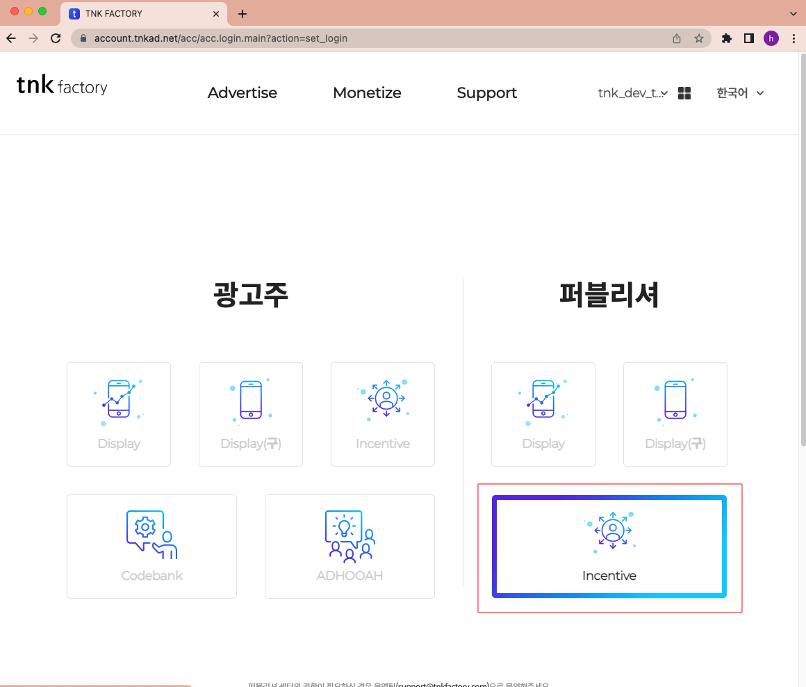
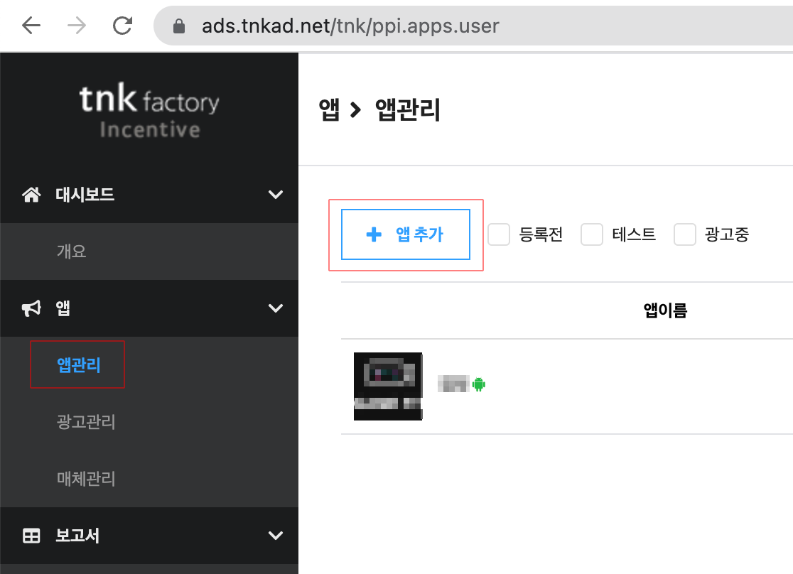
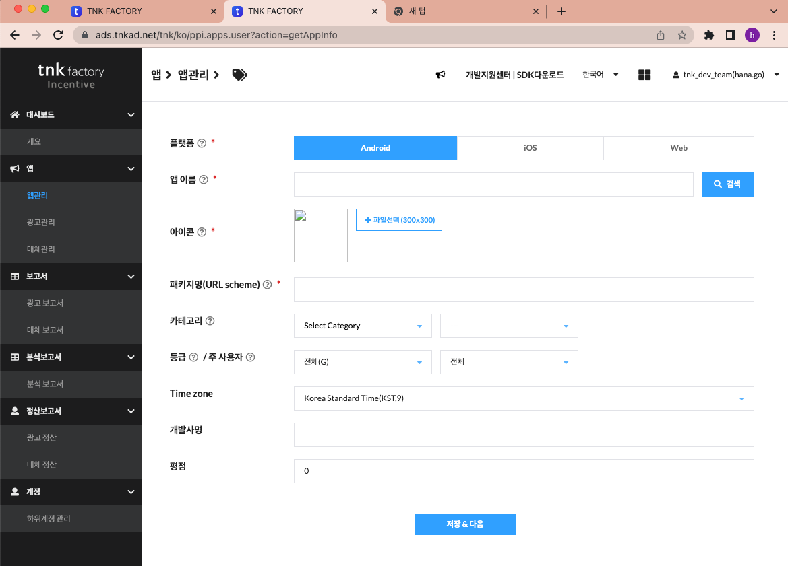
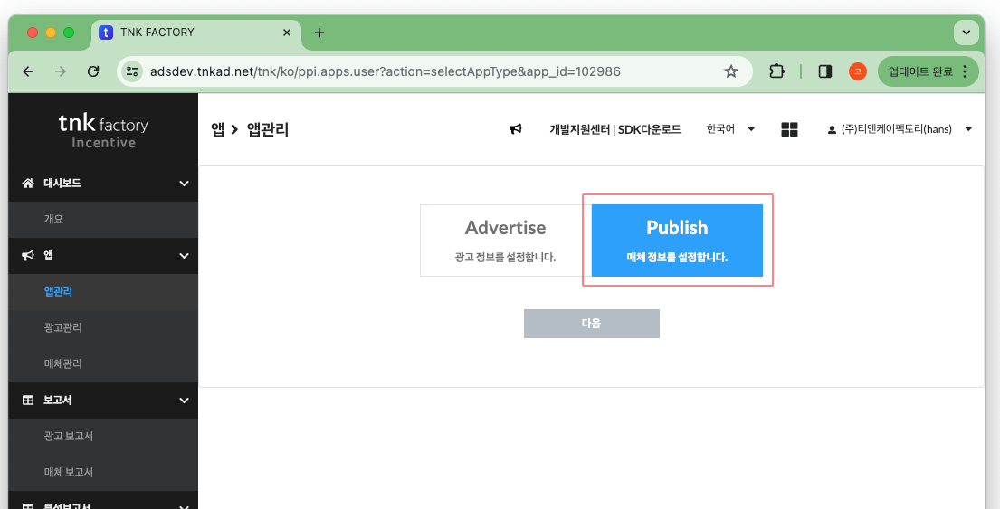
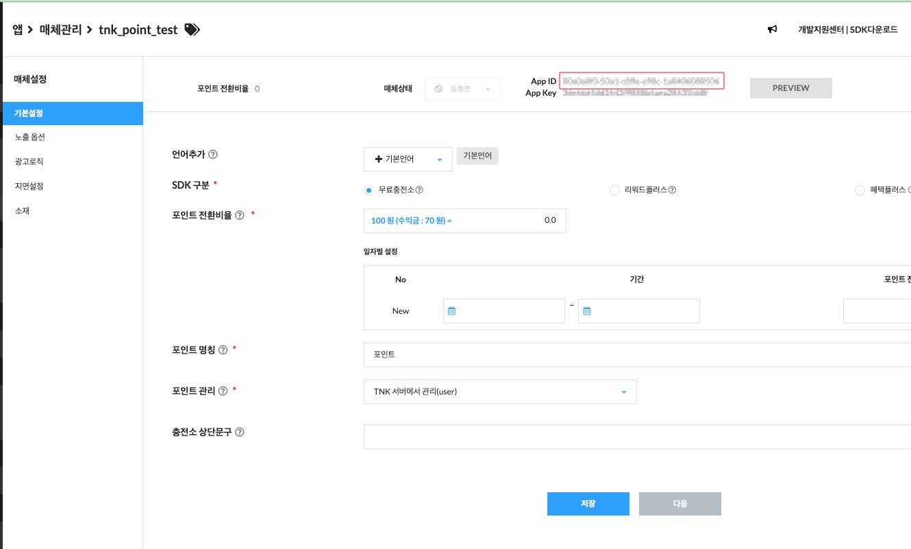

## 오퍼월 퍼블리셔 설정 가이드

오퍼월 매체를 등록하고 app id를 획득하는 과정을 안내합니다. 

---

### 광고 매체 등록하기
보상형 광고를 탑재하기 위해서는 다음과 같은 단계를 거쳐야 합니다.

1. incentive 메뉴를 선택합니다.

2. [앱 관리] -> [앱 추가] 를 선택합니다.

3. 앱 등록에 필요한 정보를 입력합니다.

* 플랫폼 : 사용 할 플랫폼을 설정합니다. (android iOS 각각 등록하셔야 합니다.)
* 앱 이름 : 관리 페이지에서 사용 할 앱의 이름입니다.
* 아이콘 : 앱의 아이콘을 등록합니다. 300x300미만 png파일로 등록 해 주세요
* 패키지명 : 안드로이드의 경우 앱의 패키지명, iOS의 경우 appscheme를 입력합니다.
* 카테고리 : 적용 할 매체의 관련 카테고리를 선택합니다.(미 지정시 기본 값 사용, But 광고 수익 향상을 위해 선택 권장)
* 등급, 주 사용자 : 해당 매체에 나갈 광고의 연령 등급과 주 사용자 성별 필터입니다.
* time zone : 앱이 주로 사용되는 지역의 타임존 값을 선택합니다.
* 개발사명 : 해당 플랫폼을 개발하는 개발사명입니다.

4. publish를 선택합니다.

5. 상단 영역의 app id를 확인합니다.

연동가이드를 확인 하시고 AndroidManifest.xml, 또는 Info.plist에 적용합니다.
   

