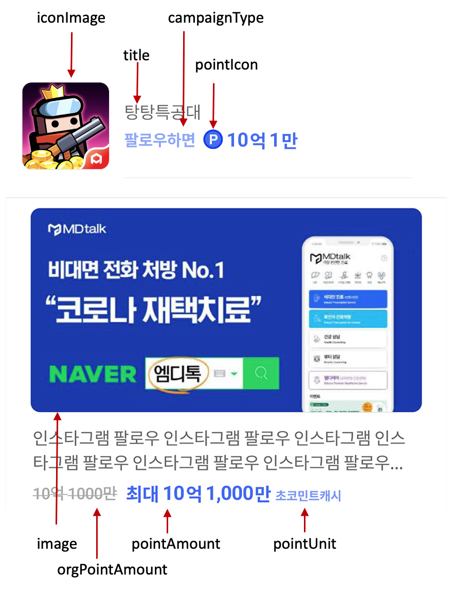

## 신규 오퍼월 UI 커스터마이징 가이드


새로운 보상형 SDK는 사용자에게 적절한 광고를 보다 효과적으로 제공하기 위하여 기본 광고 목록외에 추가로 다양한 큐레이션 UI 를 제공합니다. 큐레이션은 사용자가 참여 중인 멀티리워드 광고, 새로 등록된 광고, 운영자 추천 광고 등을 페이징 방식, 횡스크롤 방식 등으로 기본 광고 목록과 구별되는 방식으로 제공함으로써 사용자의 주목도를 높일 수 있습니다.

또한 여러 종류의 큐레이션 UI 를 쉽게 커스터마이징 할 수 있는 다수의 View 와 Layout 들이 만들어져 있으며, 개발사가 원할 경우 완전히 다른 형태의 UI 도 구현될 수 있도록 기능을 제공하고 있습니다.


#### 일반 광고 UI 예시


#### 구매형 광고 UI 예시


## 광고 UI 구성

광고 목록 표시를 위하여 AdListItemView 와 AdListItemViewLayout 이 사용됩니다. AdListItemView는 하나의 광고 아이템이 표시되는 View 이며 내부에 아이콘 이미지, 타이틀, 포인트 등의 구성 요소들이 배치되어 있습니다.


### DefaultAdListItemView

기본으로 제공되는 목록형 이외에 소재 이미지를 출력하여 피드형으로 구현 하실 수 있습니다.

피드형으로 출력을 원하실 경우 com_tnk_off_ad_list_normal_feed.xml 파일을 참고 하시기 바랍니다.

광고 항목은 아래의 이미지와 같은 형태의 배치를 가지고 있으며 기본 광고 목록을 표시하기 위하여 사용됩니다.



#### iconImage : 광고의 아이콘 이미지
#### image : 광고 소재 이미지
#### title : 광고의 제목
#### subTitle : 광고 요약 설명
#### campaignType : 광고 타입
#### pointIcon : 포인트 단위 앞에 위치하는 아이콘 입니다.
#### orgPointAmount : n배 이벤트를 할 경우 n배 적용 전 포인트
#### pointAmount : 적립 받을 수 있는 포인트 금액입니다. n배 이벤트를 진행중이라면 적용된 금액이 리턴됩니다.
#### pointUnit : 포인트의 단위
#### status : 광고의 특정 진행 상태입니다.
 - 설치형 광고 설치 확인 대기 중 
 - 구매형 상품 일일 구매 한도 초과
 - 광고 종료, 적립 완료 등 참여 불가능한 상태


## 1. UI 커스텀 샘플 이용

**샘플코드의 EmbedActivityC.kt 파일을 참고 하시기 바랍니다.**

샘플 프로젝트에는 각 타입별 레이아웃 샘플 파일이 있습니다.

- TnkAdListMultiJoin.kt
- TnkAdListNew.kt
- TnkAdListNormal.kt
- TnkAdListPromotion.kt
- TnkAdListSuggest.kt

- com_tnk_off_ad_list_normal.xml
- com_tnk_off_ad_list_promotion.xml
- com_tnk_off_ad_list_suggest.xml
- com_tnk_off_ad_list_new.xml
- com_tnk_off_ad_list_multi.xml
- com_tnk_off_ad_list_cps_favorite.xml
- com_tnk_off_ad_list_cps_new.xml
- com_tnk_off_ad_list_cps_normal.xml
- com_tnk_off_ad_list_cps_popular.xml
- com_tnk_off_ad_list_cps_recommend.xml
- com_tnk_off_ad_list_cps_reward.xml
- com_tnk_off_ad_list_cps_search.xml
- com_tnk_off_ad_list_news.xml

각 타입별 xml파일과 해당 view에 컨텐츠를 출력하는 코드를 수정하여 원하는 레이아웃을 구성 하실 수 있습니다.

```kotlin
fun setAdLayoutConfig() {

    TnkAdConfig.setLayoutInfo(TnkLayoutType.AD_LIST_NORMAL, TnkAdListNormal::class, TnkAdLayoutNone::class)
    TnkAdConfig.setLayoutInfo(TnkLayoutType.AD_LIST_PROMOTION, TnkAdListPromotion::class, TnkAdListItemLayout::class)
    TnkAdConfig.setLayoutInfo(TnkLayoutType.AD_LIST_NEW, TnkAdListNew::class, TnkBasicCurationTypeNew::class)
    TnkAdConfig.setLayoutInfo(TnkLayoutType.AD_LIST_SUGGEST, TnkAdListSuggest::class, TnkBasicCurationTypeSuggest::class)
    TnkAdConfig.setLayoutInfo(TnkLayoutType.AD_LIST_MULTI, TnkAdListMultiJoin::class, TnkSectionHorizontalSingle::class)

    TnkAdConfig.setLayoutInfo(TnkLayoutType.AD_LIST_CPS_NORMAL, TnkAdListCpsNormal::class, TnkAdListLayoutCpsNone::class)
    TnkAdConfig.setLayoutInfo(TnkLayoutType.AD_LIST_CPS_FAVORITE, TnkAdListCpsCard::class, TnkSectionHorizontalSingle::class)
    TnkAdConfig.setLayoutInfo(TnkLayoutType.AD_LIST_CPS_POPULAR, TnkAdListCpsGrid::class, TnkAdListLayoutCpsF::class)
    TnkAdConfig.setLayoutInfo(TnkLayoutType.AD_LIST_CPS_REWARD, TnkAdListCpsGrid::class, TnkAdListLayoutCpsF::class)
    TnkAdConfig.setLayoutInfo(TnkLayoutType.AD_LIST_CPS_NEW, TnkAdListCpsNormal::class, TnkAdListItemLayout::class)
    TnkAdConfig.setLayoutInfo(TnkLayoutType.AD_LIST_CPS_RECOMMEND, TnkAdListCpsCard::class, TnkSectionHorizontalSingle::class)
}
```

```kotlin
class LayoutType {
    // 일반광고
    const val normal = 0
    const val promotion = 1  // 소진 큐레이션
    const val new = 2    // 신규 큐레이션
    const val suggest = 3    // 운영자 등록 큐레이션
    const val multi = 9      // 참여중인 멀티리워드 캠페인
    const val noAd = 99     // 광고 없을때 SDK가 생성하는 추천 광고 큐레이션
    
    // 구매형
    const val cpsNormal = 10       // CPS 기본 목록
    const val capFavorite = 11      // 관심상품, 최근 구매
    const val cpsPopular = 12       // 구매형 인기상품
    const val cpsReward = 13        // 구매형 리워드 가성비
    const val cpsNew = 14       // 구매형 신규상품
    const val cpsRecommend = 15     // 구매형 운영자 등록
    const val cpsSearch = 16        // 검색 + CPS My메뉴 아이템
    const val cpsNoAd = 19         // CPS 상품 없을때 SDK가 생성하는 추천 광고 큐레이션
    
    // 컨텐츠
    const val newsList = 31      // 뉴스(컨텐츠) 기본 목록
}
```


## 2. TnkAdListBasicItem 클래스 구현


viewHolder를 구현하는 방법을 설명합니다.

TnkAdListBasicItem 클래스를 상속받으신 후 이하의 함수를 구현 하시면 됩니다.

### 레이아웃 지정
```kotlin
/**
 * viewHolder 출력에 사용 할 레이아웃 id를 리턴하도록 구현합니다.
 */
fun getLayout():Int
```


### onBind 함수 직접 구현
```kotlin
// 해당 아이템의 onBind 시점에 호출되는 UI출력 내용 구성 구현 
fun bind(viewHolder: GroupieViewHolder, position: Int)
```


### 한 행에 출력 할 갯수 지정
```kotlin
// 12 사이즈의 GrideView로 구성되어 있으며 12를 리턴하면 1행에 1개의 아이템이 출력되며
// 6을 리턴하면 한행에 2개씩 4를 리턴하면 한 행에 3개씩 아이템이 출력됩니다.
// HorizontalScrollView를 사용 할 경우에는 설정하지 않습니다.
fun getSpanSize(spanCount: Int, position: Int): Int
```

### 광고 정보 조회 함수


그 외에 아래 제공된 함수를 사용하여 원하시는 항목을 출력 하실 수 있습니다.

#### iconImage : 광고의 아이콘 이미지
 - fun getIconUrl():String 
#### image : 광고 소재 이미지
- fun getImageUrl():String
#### title : 광고의 제목
- fun getTitle():String
#### subTitle : 광고 요약 설명
- fun getSubTitle():String
#### campaignType : 광고 타입
- fun getCampaignType():String
#### pointIcon : 포인트 단위 앞에 위치하는 아이콘 입니다.
- fun getIconDrawable():Drawable
#### orgPointAmount : n배 이벤트를 할 경우 n배 적용 전 포인트
- fun getOrgPoint():Long
- fun getOrgPointString():String
#### pointAmount : 적립 받을 수 있는 포인트 금액입니다. n배 이벤트를 진행중이라면 적용된 금액이 리턴됩니다.
- fun getPoint():Long
- fun getPointString():String
#### pointUnit : 포인트의 단위
- fun getUnit():String
#### status : 광고의 특정 진행 상태입니다.
- fun getStatus():Int
- 0 : 이상 없음
- 1 : 설치형 광고 설치 확인 대기 중
- 2 : 구매형 상품 일일 구매 한도 초과
- 3 : 광고 종료, 적립 완료 등 참여 불가능한 상태(해당 광고는 목록에서 제외됩니다.) 

#### direction : 해당 광고가 좌(LEFT),우(RIGHT), 해당 섹션의 최 하단(BOTTOM)에 있는지 확인 할 수 있습니다.

### sample
```kotlin

open class TnkAdListNormal : TnkAdListBasicItem() {
    
    override fun bind(viewHolder: GroupieViewHolder, position: Int) {
        super.bind(viewHolder, position)

        viewHolder.itemView.let { v ->
        
            val tvText = v.findViewById(R.id.tv_test) as TextView
            if(getPoint() > 1000){
              tvText.text = "추천!!"
            }
            
            if (direction == TnkDirection.BOTTOM) {
                getDivider()?.visibility = View.GONE
            } else {
                getDivider()?.visibility = View.VISIBLE
            }

            v.setOnClickListener { onItemClick() }
        }
    }

    override fun getSpanSize(spanCount: Int, position: Int) {
        return 12
    }
    override fun getLayout(): Int {
        return R.layout.com_tnk_off_ad_list_normal
    }
}
```

### 광고의 상태에 따른 UI 항목 출력 여부

| /          |    포인트     | 원래의 포인트  | 멀티리워드 여부 | 광고 타입 | 포인트 단위 | 포인트 아이콘 | 광고 상태 |
|------------|:----------:|:--------:|:--------:|:-----:|:------:|:-------:|:-----:|
| 포인트 아이콘 사용 |     -      |    -     |    -     |   -   |   -    |    X    |   O   |
| 포인트 단위 사용  |     -      |    -     |    -     |   -   |   -    |    O    |   X   |
| 멀티 리워드     |     -      |    -     |    -     |   O   |   -    |    -    |   -   |
| n배 이벤트     | n배 적용된 포인트 | 미 적용 포인트 |    O     |   X   |   O    |    O    |   X   |
| 설치 확인 대기   |     X      |    X     |    X     |   X   |   X    |    X    |   O   |
| 적립 완료      |     X      |    X     |    X     |   X   |   X    |    X    |   O   |


### 광고 타입 정의

| 번호 | 광고 타입        | 출력 명칭  |
|--------|--------------|--------|
| 109    | 클릭시          | 클릭하면   |
| 108    | 출석형          | 클릭하면   |
| 100    | 설치           | 받으면    |
| 101    | 실행           | 오픈하면   |
| 303    | 유튜브시청        | 시청하면   |
| 300    | 동영상(자체)      | 시청하면   |
| 301    | 유튜브 동영상      | 시청하면   |
| 302    | 네이버 동영상      | 시청하면   |
| 399    | 동영상(기타)      | 시청하면   |
| 202    | 인스타그램 팔로우    | 팔로우하면  |
| 222    | 인스타그램 팔로우 유지 | 미션달성 시 |
| 206    | 유튜브 구독       | 구독하면   |
| 226    | 유튜브 구독 유지    | 미션달성 시 |
| 200    | 페이스북 좋아요     | 좋아요하면  |
| 220    | 페이스북 좋아요 유지  | 미션달성 시 |
| 201    | 트위터 팔로우      | 팔로우하면  |
| 221    | 트위터 팔로우 유지   | 미션달성 시 |
| 208    | 네이버뉴스 구독     | 구독하면   |
| 228    | 네이버뉴스 구독 유지  | 미션달성 시 |
| 209    | 카카오채널추가      | 채널추가하면 |
| 229    | 카카오채널추가 유지   | 미션달성 시 |
| 203    | 카스 소식받기      | 소식받으면  |
| 223    | 카스 소식받기 유지   | 미션달성 시 |
| 210    | 네이버TV구독      | 구독하면   |
| 230    | 네이버TV구독유지    | 미션달성 시 |
| 211    | 네이버블로그이웃추가   | 추가하면   |
| 231    | 네이버블로그이웃추가유지 | 미션달성 시 |
| 212    | 링크드인 팔로우     | 팔로우하면  |
| 232    | 링크드인 팔로우 유지  | 미션달성 시 |
| 213    | 틱톡 팔로우       | 팔로우하면  |
| 233    | 틱톡 팔로우 유지    | 미션달성 시 |
| 299    | SNS(기타)      | 참여하면   |
| 251    | 카드신청         | 참여하면   |
| 252    | 계좌개설         | 참여하면   |
| 253    | 보험가입         | 가입하면   |
| 254    | 보험조회         | 조회하면   |
| 205    | DB수집         | 참여하면   |
| 298    | 미션달성(금융)     | 참여하면   |
| 110    | 캐릭터생성        | 참여하면   |
| 105    | 레벨달성         | 참여하면   |
| 107    | 사전예약         | 참여하면   |
| 106    | 튜토리얼         | 참여하면   |
| 403    | 재화, 아이템 결제   | 결제하면   |
| 198    | 미션달성(게임)     | 참여하면   |
| 104    | 앱 회원가입       | 가입하면   |
| 204    | 사이트회원가입      | 가입하면   |
| 102    | 카톡로그인        | 로그인하면  |
| 103    | 로그인(카톡제외)    | 로그인하면  |
| 207    | 네이버카페 가입     | 가입하면   |
| 255    | 이벤트참여        | 참여하면   |
| 256    | 포인트/쿠폰교환     | 참여하면   |
| 257    | 설문조사         | 참여하면   |
| 199    | 액션(기타)       | 참여하면   |
| 259    | 장바구니         | 담으면    |
| 260    | 신청           | 신청하면   |
| 402    | 유료결제         | 결제하면   |
| 400    | 생활           | 구매하면   |
| 400    | 식품           | 구매하면   |
| 400    | 건강           | 구매하면   |
| 400    | 뷰티           | 구매하면   |
| 400    | 잡화           | 구매하면   |

